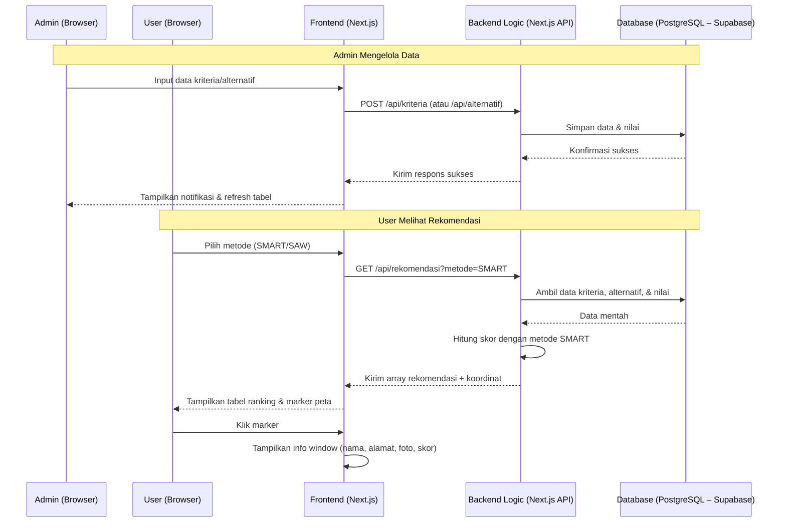
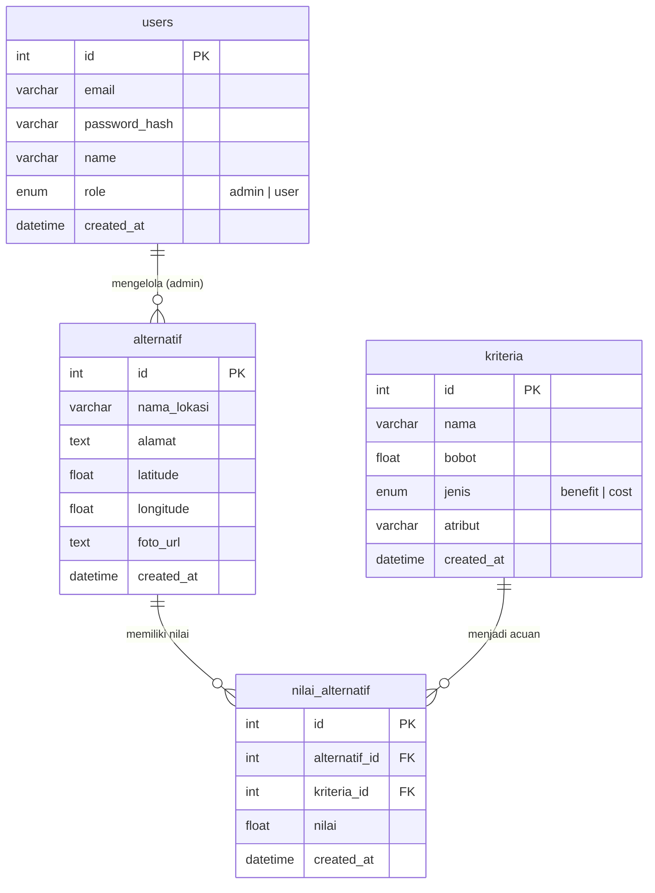

# PRD — Project Requirements Document

## 1. Overview

Aplikasi **SMARTLOC** merupakan sistem pendukung keputusan berbasis web yang dirancang untuk membantu pelaku usaha di Kota Manado menentukan lokasi usaha yang paling sesuai. Permasalahan utama yang ingin diselesaikan adalah sulitnya calon pengusaha mengevaluasi berbagai alternatif lokasi secara objektif dengan mempertimbangkan kriteria-kriteria penting seperti jumlah penduduk, luas daerah, jarak ke pusat kota, harga sewa, dan tingkat persaingan.

Tujuan utama aplikasi adalah menyediakan platform yang memungkinkan pengguna umum (pelaku usaha) mendapatkan rekomendasi lokasi terbaik berdasarkan perhitungan metode **SMART** (Simple Multi Attribute Rating Technique) dan metode **SAW** (Simple Additive Weighting) sebagai opsi pembanding. Admin sistem dapat mengelola data kriteria, alternatif, serta menghasilkan laporan perankingan. Setiap rekomendasi dilengkapi dengan informasi detail lokasi pada peta interaktif (Google Maps).

## 2. Requirements

Berikut adalah persyaratan tingkat tinggi untuk pengembangan sistem:

- **Aksesibilitas:** Aplikasi harus dapat diakses melalui web browser (komputer/laptop) oleh pengguna umum dan administrator.
- **Pengguna:** Terdapat dua peran – **Admin** (mengelola master data, kriteria, alternatif, hasil perankingan, dan laporan) dan **User** (mendaftar, login, melihat rekomendasi, membandingkan metode).
- **Autentikasi:** Baik admin maupun user wajib melakukan registrasi dan login untuk mengakses fitur sesuai perannya.
- **Data Kriteria:** Kriteria yang digunakan adalah **jumlah penduduk**, **luas daerah**, **jarak ke pusat kota**, **harga sewa**, dan **persaingan**. Masing-masing memiliki bobot, jenis (benefit/cost), dan atribut yang dapat dikelola admin.
- **Data Alternatif:** Sumber data berasal dari input manual admin dan data eksternal (Dinas Koperasi & UMKM Kota Manado, Dinas Koperasi & UMKM Provinsi Sulawesi Utara, Dinas Penanaman Modal & PTSP Kota Manado, Dinas Penanaman Modal & PTSP Sulawesi Utara, serta workshop online).
- **Metode Perhitungan:** Metode utama adalah **SMART**, sedangkan metode **SAW** dapat dipilih pengguna untuk melihat perankingan alternatif.
- **Peta Interaktif:** Menampilkan titik lokasi alternatif beserta nama tempat, alamat, foto, dan skor perankingan menggunakan layanan **Google Maps**.
- **Laporan:** Admin dapat mencetak atau mengekspor laporan hasil perankingan.

## 3. Core Features

Fitur-fitur kunci yang harus ada dalam versi pertama (MVP):

1.  **Autentikasi & Manajemen Pengguna**
    - Registrasi dan login untuk admin dan user.
    - Pembatasan akses berdasarkan peran (role-based access control).

2.  **Dashboard Admin**
    - Ringkasan jumlah kriteria, alternatif, dan pengguna.
    - Tautan cepat ke menu pengelolaan data.

3.  **Manajemen Kriteria**
    - Tambah, edit, dan hapus kriteria.
    - Kolom: Nama Kriteria, Bobot (0–100), Jenis (Benefit/Cost), Atribut (opsional).

4.  **Manajemen Alternatif**
    - Tambah, edit, dan hapus alternatif lokasi.
    - Kolom: Nama Lokasi, Alamat, Koordinat (latitude/longitude), Foto (URL), Nilai per Kriteria.

5.  **Input Nilai Alternatif**
    - Form untuk memasukkan nilai setiap alternatif pada setiap kriteria (dapat dilakukan bersamaan saat input alternatif atau melalui halaman terpisah).

6.  **Perhitungan & Rekomendasi**
    - Pilih metode (SMART atau SAW).
    - Tampilkan tabel perankingan lengkap dengan skor akhir.
    - Urutkan dari nilai tertinggi ke terendah.

7.  **Peta Interaktif**
    - Tampilan Google Maps dengan marker setiap alternatif.
    - Info window berisi nama, alamat, foto, dan skor perankingan.

8.  **Laporan Perankingan**
    - Halaman laporan yang menampilkan hasil perankingan untuk metode SMART dan SAW.
    - Tombol cetak/ekspor (PDF/Excel).

## 4. User Flow

Alur kerja sederhana bagi **Admin** dan **User** saat menggunakan aplikasi:

### Admin Flow
1.  **Login/Registrasi:** Admin masuk menggunakan email dan password.
2.  **Kelola Kriteria:** Menambah, mengedit, atau menghapus kriteria beserta bobot dan jenisnya.
3.  **Kelola Alternatif:** Menambahkan data alternatif lokasi (nama, alamat, koordinat, foto) beserta nilai untuk setiap kriteria.
4.  **Lihat Rekomendasi:** Admin dapat melihat hasil perankingan (SMART dan SAW) untuk verifikasi.
5.  **Generate Laporan:** Admin membuka menu laporan dan mencetak/ekspor hasil.

### User Flow
1.  **Registrasi/Login:** Pengguna baru mendaftar, kemudian login.
2.  **Pilih Metode:** Setelah masuk, pengguna memilih metode perhitungan (SMART atau SAW) pada halaman rekomendasi.
3.  **Lihat Hasil Perankingan:** Sistem menampilkan daftar lokasi terurut berdasarkan skor tertinggi.
4.  **Eksplorasi Peta:** Pengguna dapat mengklik marker pada peta untuk melihat detail lokasi (nama, alamat, foto, skor).
5.  **Logout:** Pengguna keluar dari sistem.

## 5. Architecture

Berikut adalah gambaran arsitektur sistem dan aliran data:

## 6. Database Schema

Berikut adalah Entity Relationship Diagram (ERD) yang menggambarkan struktur database utama:

| Tabel | Deskripsi |
|-------|-----------|
| **users** | Data admin dan user pengguna sistem, disertai peran (role) |
| **kriteria** | Master kriteria penilaian beserta bobot, jenis (benefit/cost) |
| **alternatif** | Data lokasi usaha yang akan dinilai, termasuk koordinat dan foto |
| **nilai_alternatif** | Menyimpan nilai dari setiap alternatif untuk setiap kriteria |

## 7. Design & Technical Constraints

Bagian ini mengatur batasan teknis dan panduan desain yang harus dipatuhi tanpa mendikte pemilihan library secara spesifik.

1.  **High-Level Technology:**
    Sistem harus dibangun menggunakan **Next.js** sebagai fullstack framework (frontend dan backend API) dengan database **PostgreSQL** yang dihosting di **Supabase**. Pengembang bebas memilih pustaka tambahan untuk peta (misal `@react-google-maps/api`), autentikasi, dan styling selama sesuai dengan arsitektur yang ditetapkan.

2.  **Typography Rules:**
    Sistem antarmuka (UI) wajib menggunakan konfigurasi font variable sebagai berikut untuk menjaga konsistensi visual:
    -   **Sans:** `Geist Mono, ui-monospace, monospace`
    -   **Serif:** `serif`
    -   **Mono:** `JetBrains Mono, monospace`

3.  **Peta Interaktif:**
    Layanan peta yang digunakan adalah **Google Maps JavaScript API**. Setiap marker harus menampilkan info window yang berisi nama alternatif, alamat, foto (jika ada), dan skor perankingan dari metode yang dipilih.

4.  **Keamanan:**
    Autentikasi menggunakan JWT (JSON Web Token) yang dikelola oleh Supabase Auth. Endpoint API yang memodifikasi data hanya dapat diakses oleh admin (berdasarkan role).

5.  **Responsivitas:**
    Tampilan utama (tabel perankingan, peta) harus dapat diakses dengan nyaman pada layar laptop/desktop (minimal 1024px lebar).